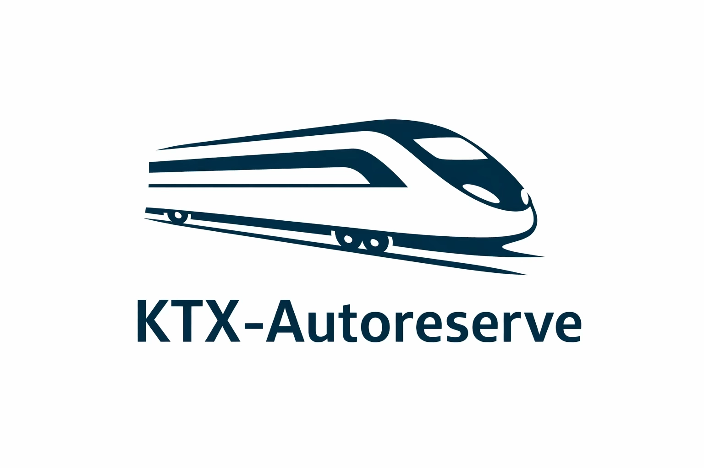
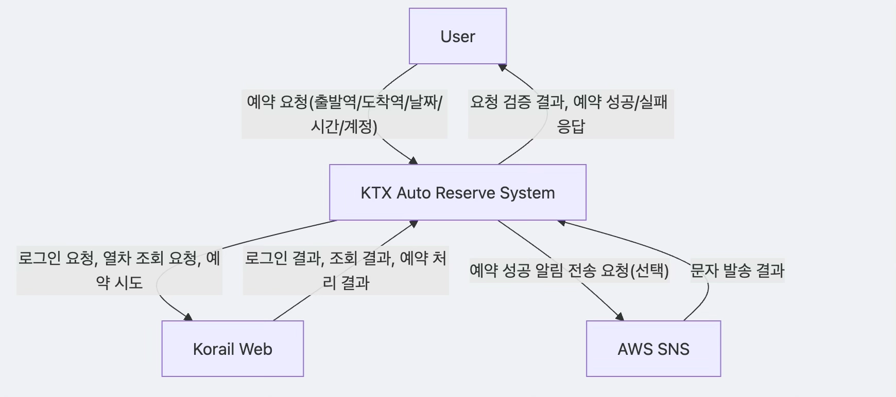

# Conceptualization

## KTX-AutoReserve

(Student No, Name, E-mail)  
22112063, 신동현, sindong106@yu.ac.kr

---

## Revision history

| Revision date | Version # | Description | Author |
|---|---|---|---|
| 2026.03.27 | 1.0.0 | First Draft | 신동현 |

---

## Contents

1. Business purpose
2. System context diagram
3. Use case list
4. Concept of operation
5. Problem statement
6. Glossary
7. References

---

## 1. Business purpose

### Background
코레일 승차권 예매는 출퇴근 시간대, 주말 이동 시간대, 명절·연휴 등 특정 구간에서 수요가 집중되어 좌석 확보 경쟁이 매우 치열하다. 이 과정에서 사용자는 짧은 간격으로 조회를 반복하고, 조건에 맞는 열차를 발견하면 즉시 클릭해 예약을 시도해야 한다.

그러나 수동 방식은 피로도가 높고, 반복 작업 중 실수(시간 선택 오류, 버튼 클릭 지연, 팝업 미처리 등)가 발생하기 쉽다. 또한 웹 UI 구조 변경이나 팝업 노출 여부에 따라 동일한 작업의 성공률이 달라지는 문제도 존재한다.

본 프로젝트는 이러한 한계를 개선하기 위해 코레일 웹 기반 예매 흐름을 자동화한다. 로그인, 예매 페이지 이동, 출발/도착/일시 조건 설정, 열차 목록 탐색, 예약 버튼 클릭까지의 절차를 일관된 로직으로 수행하여 사용자의 반복 부담을 줄이고 예약 시도의 신속성과 안정성을 높이는 것을 목표로 한다. 더 나아가 API 기반 인터페이스를 제공함으로써 자동화 아키텍처 학습 및 확장 실험에도 활용 가능한 구조를 지향한다.

### Goal
본 프로젝트의 핵심 목표는 단일 API 요청만으로 로그인부터 예약 시도까지의 절차를 자동 수행하는 것이다. 이를 통해 사용자가 반복적으로 웹 화면을 새로고침하고 버튼을 클릭해야 하는 부담을 줄이고, 동일한 조건에서 일관된 방식으로 예매를 수행할 수 있도록 한다.

또한 출발역, 도착역, 날짜, 시간 범위를 기반으로 탐색 조건을 명확히 적용하여 원하는 열차만 선별 조회하도록 설계한다. 조건에 맞는 KTX 열차가 확인되면 즉시 예약을 시도하고, 좌석이 없을 경우에는 재조회 과정을 통해 기회를 지속적으로 탐색한다.

입력값 누락, 형식 오류, 실행 중 예외 상황에 대해서는 명확한 응답 메시지를 제공하여 디버깅과 사용자 대응을 쉽게 한다. 구조적으로는 컨트롤러, 서비스, 예외 처리 책임을 분리해 확장성과 유지보수성을 확보한다.

### Target market
본 시스템의 주요 대상은 정해진 시간대에 KTX를 자주 예매해야 하는 사용자이다. 또한 Selenium 기반 웹 자동화 구조를 학습하려는 개발자 및 학생도 대상에 포함된다.

---

## 2. System context diagram

### 외부 액터 및 시스템
- 사용자(User): 예약 조건을 입력해 API 호출
- Spring Boot API: 요청 검증 및 예약 흐름 제어
- Selenium WebDriver: 브라우저 UI 자동 제어
- 코레일 웹 시스템(Korail Web): 로그인/조회/예약 화면 제공
- AWS SNS(선택 사항): 예약 성공 시 문자 발송

### 시스템 상호작용 흐름
1. 사용자가 `/ticket/reserve`로 요청을 전송한다.
2. `TicketController`가 파라미터 형식과 범위를 검증한다.
3. `TicketService`가 브라우저를 열고 로그인/탐색/예약을 수행한다.
4. 성공 시 성공 메시지를 반환하고, 필요 시 문자 알림을 보낸다.
5. 실패/예외 시 `GlobalExceptionHandler` 또는 컨트롤러 검증에서 400 응답을 반환한다.

---

## 3. Use case list

### 1) 티켓 예약 요청
| 항목 | 내용 |
|---|---|
| Actor | User |
| Description | 필수 파라미터를 포함해 예약 API를 호출한다. |

### 2) 요청 파라미터 검증
| 항목 | 내용 |
|---|---|
| Actor | 시스템(`TicketController`) |
| Description | 누락/타입/범위/시간 순서를 검증한다. |

### 3) 브라우저 세션 초기화
| 항목 | 내용 |
|---|---|
| Actor | 시스템(`TicketService`) |
| Description | WebDriver 생성 및 브라우저 환경을 준비한다. |

### 4) 코레일 로그인
| 항목 | 내용 |
|---|---|
| Actor | 시스템(`KorailLoginService`) |
| Description | 로그인 페이지 접근, 팝업 처리, 아이디/비밀번호 입력, 로그인 버튼 클릭을 수행한다. |

### 5) 예약 화면 이동
| 항목 | 내용 |
|---|---|
| Actor | 시스템 |
| Description | 로그인 후 일반 승차권 조회/예약 화면으로 이동한다. |

### 6) 조회 조건 입력
| 항목 | 내용 |
|---|---|
| Actor | 시스템(`SearchCriteriaService`) |
| Description | 출발역/도착역/날짜/시간을 UI 팝업에서 선택한다. |

### 7) 열차 목록 조회 및 반복 탐색
| 항목 | 내용 |
|---|---|
| Actor | 시스템 |
| Description | 조건 조회 후 결과 목록을 재조회하며 가용 좌석을 탐색한다. |

### 8) 조건 일치 열차 예약 시도
| 항목 | 내용 |
|---|---|
| Actor | 시스템(`TicketReservationService`) |
| Description | 시간대/열차종(KTX) 조건을 만족하면 예약 버튼을 클릭한다. |

### 9) 결과 응답 반환
| 항목 | 내용 |
|---|---|
| Actor | 시스템 |
| Description | 예약 성공/실패 메시지를 API 응답으로 반환한다. |

### 10) 예외 응답 처리
| 항목 | 내용 |
|---|---|
| Actor | 시스템(`GlobalExceptionHandler`) |
| Description | 누락 파라미터/타입 오류를 사용자 친화 메시지로 변환한다. |

---

## 4. Concept of operation

### 1) KorailReserveApplication (구현 클래스)
| 항목 | 내용 |
|---|---|
| Purpose | 애플리케이션 기동 및 스프링 컨텍스트 초기화 |
| Approach | `main()`에서 `SpringApplication.run(...)` 호출 |
| Dynamics | 서버 프로세스 시작 시 1회 실행 |
| Goals | 컨트롤러/서비스/설정 빈을 로드해 API 제공 |

### 2) TicketController (구현 클래스)
| 항목 | 내용 |
|---|---|
| Purpose | HTTP 요청 수신 및 입력 검증 |
| Approach | 쿼리 파라미터 검증 후 서비스 호출 |
| Dynamics | `/ticket/reserve` 호출 시마다 실행 |
| Goals | 잘못된 요청을 조기에 차단하고 정상 입력만 전달 |

### 3) TicketService (구현 클래스)
| 항목 | 내용 |
|---|---|
| Purpose | 예약 자동화 전체 시나리오 오케스트레이션 |
| Approach | 드라이버 생성 -> 로그인 -> 화면 이동 -> 조건 설정 -> 탐색 -> 예약 -> 종료 |
| Dynamics | 요청 단위로 실행되고 종료 시 드라이버 정리 |
| Goals | 예약 성공률 향상 및 안정적인 자원 해제 |

### 4) GlobalExceptionHandler (구현 클래스)
| 항목 | 내용 |
|---|---|
| Purpose | 공통 예외를 일관된 400 응답으로 반환 |
| Approach | `@RestControllerAdvice`로 누락 파라미터/타입 예외 처리 |
| Dynamics | 바인딩 예외 발생 시 자동 개입 |
| Goals | Whitelabel 대신 의미 있는 오류 메시지 제공 |

### 5) SwaggerConfig (구현 클래스)
| 항목 | 내용 |
|---|---|
| Purpose | OpenAPI 문서 메타데이터 설정 |
| Approach | OpenAPI 빈 등록으로 제목/버전/설명 제공 |
| Dynamics | 앱 시작 시 초기화 |
| Goals | API 테스트/문서 확인 편의성 향상 |

### 6) SmsSender (구현 클래스)
| 항목 | 내용 |
|---|---|
| Purpose | 예약 성공 시 SMS 알림 전송 |
| Approach | AWS SNS 클라이언트로 메시지 publish |
| Dynamics | 성공 알림 로직 활성화 시에만 호출 |
| Goals | 사용자에게 즉시 예약 결과 통지 |

### 7) WebDriverFactory (개념 분리 클래스)
| 항목 | 내용 |
|---|---|
| Purpose | 브라우저 드라이버 생성 책임 분리 |
| Approach | Chrome/Safari 선택, 옵션(헤드리스 등), 창 크기 초기화 관리 |
| Dynamics | 예약 시작 직전에 호출 |
| Goals | 브라우저 실행 설정 변경 시 영향 범위 최소화 |

### 8) KorailLoginService (개념 분리 클래스)
| 항목 | 내용 |
|---|---|
| Purpose | 로그인 전용 UI 흐름 분리 |
| Approach | 로그인 페이지 진입, 공지 팝업 닫기, 인증 정보 입력, 로그인 수행 |
| Dynamics | 예약 절차 초반 1회 수행 |
| Goals | 로그인 구간 실패율 감소 및 가독성 향상 |

### 9) SearchCriteriaService (개념 분리 클래스)
| 항목 | 내용 |
|---|---|
| Purpose | 조회 조건 입력 로직 분리 |
| Approach | 출발/도착역 선택, 날짜 팝업 선택, 시간 슬라이더 선택 |
| Dynamics | 예약 화면 진입 직후 수행 |
| Goals | 조회 조건 입력 단계의 재사용성과 테스트 용이성 확보 |

### 10) TicketReservationService (개념 분리 클래스)
| 항목 | 내용 |
|---|---|
| Purpose | 열차 목록 판별 및 예약 클릭 책임 분리 |
| Approach | 결과 목록 순회, 출발 시각 범위 및 KTX 여부 필터링, 예약 버튼 클릭 |
| Dynamics | 조회 루프 내 반복 실행 |
| Goals | 조건 기반 의사결정 명확화 및 예약 성공 시점 단축 |

---

## 5. Problem statement

### Problem #1: 동적 UI/오버레이로 인한 클릭 불안정
코레일 화면은 모달 팝업과 동적 렌더링이 빈번하다. 이로 인해 Selenium의 요소 클릭이 가로채지거나 비활성 상태로 탐지될 수 있다.

### Problem #2: 입력 파라미터 계약 복잡성
예약 API는 필수 파라미터가 많아 누락/타입 불일치 가능성이 크다. 검증 로직과 예외 응답 체계가 없으면 사용자 경험과 디버깅 효율이 크게 저하된다.

### Problem #3: 타이밍 경쟁과 좌석 변동성
좌석 가용성은 매우 빠르게 변하며 UI 갱신 타이밍도 일정하지 않다. 적절한 대기/재시도 전략이 없으면 좌석을 놓치거나 비정상 종료 가능성이 높다.

### Problem #4: 외부 의존성 리스크
웹 페이지 구조 변경, 브라우저 드라이버 버전 차이, 네트워크 지연 등 외부 요소가 자동화 성공률에 직접적인 영향을 준다. 구성요소 분리와 예외 처리 강화가 필요하다.

---

## 6. Glossary

| Terms | Description |
|---|---|
| Reservation API | 티켓 예약 자동화 요청 엔드포인트(`/ticket/reserve`) |
| WebDriver | 브라우저를 자동 제어하는 Selenium 인터페이스 |
| Explicit Wait | 특정 조건이 만족될 때까지 대기하는 동기화 방식 |
| Popup Overlay | 메인 화면 클릭을 가로채는 모달/오버레이 계층 |
| Polling | 일정 간격으로 결과를 재조회하는 반복 전략 |
| KTX Filter | 열차 목록에서 KTX만 선별하는 조건 |
| Time Window | 사용자가 지정한 출발 시각 허용 범위 |
| Exception Handler | 예외를 HTTP 응답으로 변환하는 처리 계층 |
| OpenAPI | REST API 문서화 표준(Swagger UI 기반) |
| SNS Notification | AWS SNS를 통한 문자 알림 전송 기능 |

---

## 7. References

1. Korail 공식 홈페이지: https://www.korail.com
2. Selenium 공식 문서: https://www.selenium.dev/documentation/
3. Spring OpenAPI(springdoc): https://springdoc.org/
4. AWS SNS 개발자 가이드: https://docs.aws.amazon.com/sns/  